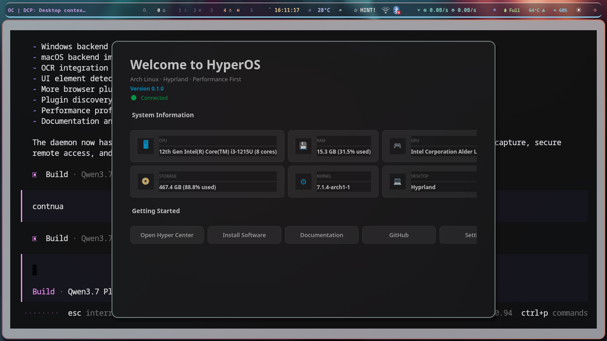
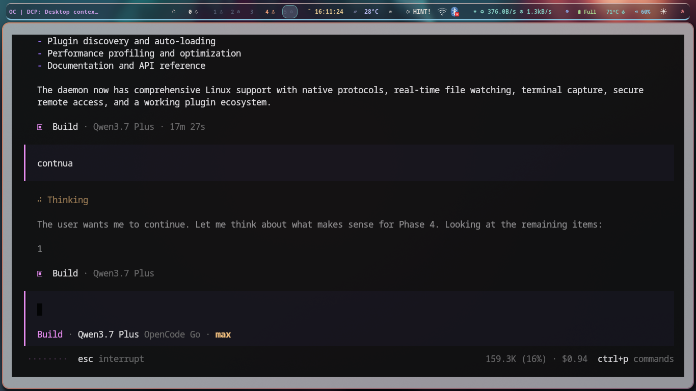
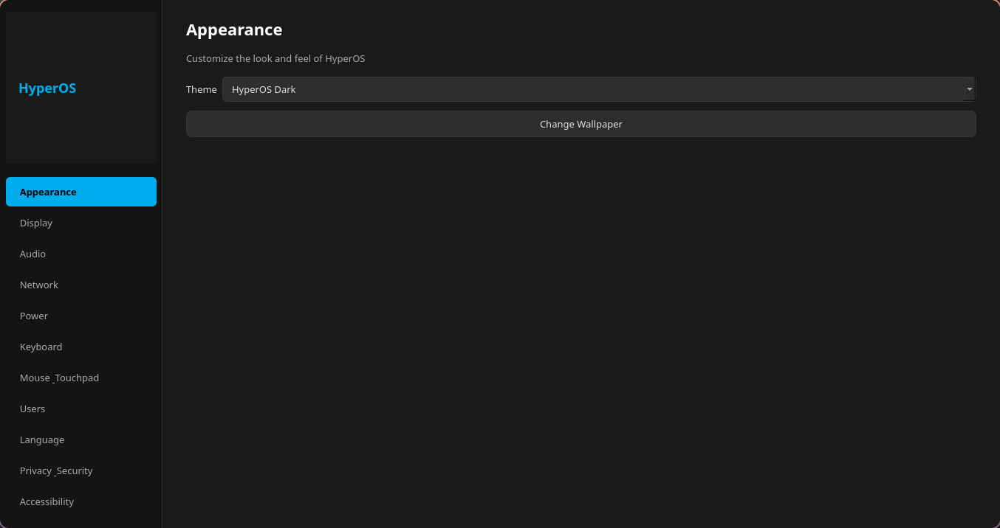
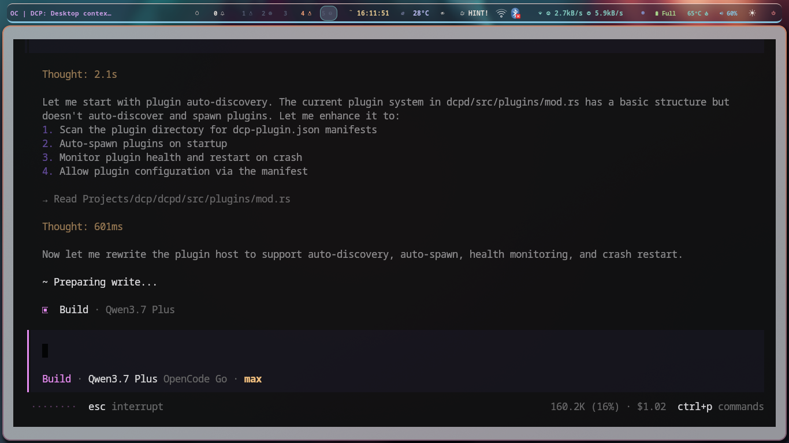

<picture>
  <source media="(prefers-color-scheme: dark)" srcset="branding/logo/hyperos.svg">
  
</picture>

# HyperOS

[](LICENSE)
[](https://archlinux.org)
[](https://hyprland.org)
[](https://python.org)
[](https://wiki.qt.io/Qt_for_Python)
[](https://archlinux.org)

**HyperOS** is an Arch Linux-based Linux distribution focused on **performance**, **minimalism**, and a **GUI-first** user experience. Built on Hyprland (Wayland) with PySide6 (Qt6) applications, it provides a fast, elegant, and professional operating system where the terminal is *optional* for everyday tasks.

---

## Screenshots

| Hyper Welcome | Hyper Center |
|---|---|
|  |  |
| **Hyper Settings** | **Hyper Store** |
|  |  |
| **Hyper Update** | |
|  | |

---

## Features

### 🚀 Performance First
- **linux-zen** kernel tuned for responsiveness
- Optimized sysctl parameters (BBR congestion control, tuned swappiness, optimized inotify)
- 4 performance profiles: Balanced, Performance, Gaming, Power Saving
- CPU governor, I/O scheduler, and swappiness dynamically adjustable
- Lightweight Hyprland compositor with hardware-accelerated rendering

### 🖥️ GUI Applications (PySide6 / Qt6)
All system administration is done through polished graphical applications:

| Application | Description |
|-------------|-------------|
| **Hyper Welcome** | First-boot welcome screen with system information and quick actions |
| **Hyper Center** | Central control panel: dashboard, system info, packages, services, network, storage, performance profiles |
| **Hyper Settings** | Full settings application: appearance, display, audio, network, power, keyboard, mouse, users, language, privacy, accessibility |
| **Hyper Update** | System updater with pacman integration, update checking, and rollback support |
| **Hyper Store** | Software center for browsing, installing, and removing packages |
| **Hyper Drivers** | Hardware detection and driver management (NVIDIA, AMD, Intel, firmware, printers, Bluetooth) |
| **Hyper Backup** | Btrfs snapshot manager with snapper integration and scheduled backups |
| **Hyper Assistant** | Offline assistant with plugin architecture and local AI readiness |
| **Hyper Installer** | 6-step graphical installer for system deployment |

### 🎨 Visual Identity
- **Color palette**: Black `#000000`, Dark Gray `#1A1A1A`, Medium Gray `#2D2D2D`, Electric Blue `#00AEEF`
- **Dark theme** applied consistently across all applications
- Custom Plymouth boot splash
- Custom GRUB theme
- Custom SDDM login theme
- HyperOS wallpapers

### 🔧 Modular Architecture
- **Clean Architecture** — Domain, Services, Widgets, UI layers
- **Dependency Injection** — Testable, maintainable code
- **Shared Core Library** — `hyperos-core` provides common services (System, Network, Pacman, Hardware, Power) and widgets (Card, Sidebar, Theme)
- **Background Threading** — UI never blocks during system information collection
- **All applications independent** — Loose coupling through the core library

### 📦 Package Management
- Full pacman integration
- AUR support (via yay/paru, configurable)
- Flatpak support (optional)
- HyperOS official package repository (planned)

---

## Quick Start

### Build the ISO

```bash
# Prerequisites
sudo pacman -S archiso base-devel git

# Clone and build
git clone https://github.com/camilin7483/hyperos.git
cd hyperos
./scripts/build-iso.sh

# The output ISO will be in out/
```

### Test in QEMU

```bash
qemu-system-x86_64 -enable-kvm -m 4096 -cdrom out/hyperos-*.iso
```

### Build Individual Packages

```bash
./scripts/build-package.sh packages/hyper-center
```

### Run an Application Directly

```bash
cd packages/hyper-center/src
PYTHONPATH=../../core python -m hyper_center
```

---

## Project Structure

```
hyperos/
├── archiso/               # ArchISO profile for ISO generation
│   ├── airootfs/          # Live environment overlay
│   ├── efiboot/           # UEFI systemd-boot configuration
│   ├── grub/              # GRUB bootloader configuration
│   ├── syslinux/          # BIOS syslinux configuration
│   ├── pacman.conf        # Pacman configuration for the ISO
│   ├── packages.x86_64    # Package list for the live environment
│   └── profiledef.sh      # ArchISO profile definition
├── branding/              # Visual identity assets
│   ├── grub/              # GRUB theme (background, fonts, colors)
│   ├── icons/             # Application and system icons
│   ├── logo/              # HyperOS logo (SVG, multiple sizes)
│   ├── plymouth/          # Boot splash screen
│   ├── sddm/              # Login/display manager theme
│   └── wallpapers/        # Default wallpapers
├── configs/               # Centralized system configuration
│   ├── hyprland/          # Hyprland desktop configuration
│   ├── network/           # NetworkManager defaults
│   ├── performance/       # CPU and performance profiles
│   ├── security/          # Firewall and sudo policies
│   ├── system/            # General system defaults
│   └── systemd/           # Journald and logind configuration
├── core/                  # Shared Python library (hyperos-core)
│   └── hyperos_core/      # Domain models, services, widgets, UI theme
├── packages/              # HyperOS system packages
│   ├── hyper-welcome/     # First-boot welcome screen
│   ├── hyper-center/      # Central control panel
│   ├── hyper-settings/    # System settings application
│   ├── hyper-update/      # System updater
│   ├── hyper-store/       # Software center
│   ├── hyper-drivers/     # Driver manager
│   ├── hyper-backup/      # Backup manager
│   ├── hyper-assistant/   # Offline assistant
│   ├── hyper-installer/   # Graphical installer
│   ├── hyper-cli/         # CLI tools
│   ├── hyper-kernel/      # Kernel manager (future)
│   └── hyper-gaming/      # Gaming mode tools
├── scripts/               # Build and maintenance scripts
├── system/                # System-level configuration
│   ├── systemd/           # Systemd service definitions
│   ├── sysctl.d/          # Kernel parameters
│   ├── modprobe.d/        # Kernel module parameters
│   ├── udev/              # Device rules
│   └── pam.d/             # PAM configuration
└── docs/                  # Technical documentation
```

---

## System Requirements

| Component | Minimum | Recommended |
|-----------|---------|-------------|
| **CPU** | 64-bit x86_64, 2 cores | 4+ cores |
| **RAM** | 2 GB | 8+ GB |
| **Storage** | 20 GB | 64+ GB (SSD recommended) |
| **GPU** | Any Vulkan-capable GPU | Intel/AMD (NVIDIA with proprietary drivers) |
| **Firmware** | UEFI | UEFI (BIOS/CSM also supported) |

---

## Development

```bash
# Set up development environment
./scripts/setup-dev.sh

# Run linting (shellcheck + PKGBUILD validation)
./scripts/lint.sh

# Run tests
./scripts/test.sh

# Build everything
./scripts/build.sh

# Clean build artifacts
./scripts/clean.sh
```

See [BUILD.md](BUILD.md) for detailed build instructions and [CONTRIBUTING.md](CONTRIBUTING.md) for contribution guidelines.

---

## Architecture

HyperOS follows a 5-layer architecture:

```
┌─────────────────────────────────────────────┐
│           GUI Applications (Qt6)            │
│  Welcome · Center · Settings · Store · ...  │
├─────────────────────────────────────────────┤
│            Core Libraries (hyperos-core)     │
│  System · Network · Pacman · Hardware · IPC │
├─────────────────────────────────────────────┤
│          Configuration System               │
│  System · Desktop · Security · Performance  │
├─────────────────────────────────────────────┤
│          System Services                    │
│  systemd · udev · polkit · pam · sysctl     │
├─────────────────────────────────────────────┤
│           Arch Linux Base                   │
│  linux-zen · pacman · glibc · systemd       │
└─────────────────────────────────────────────┘
```

Each GUI application follows **Clean Architecture** internally:

```
┌─────────────────────┐
│      UI Layer       │  PySide6 widgets, windows, stylesheets
├─────────────────────┤
│    Widgets Layer    │  Reusable components (Card, Sidebar, Button)
├─────────────────────┤
│   Services Layer    │  Business logic, external communication
├─────────────────────┤
│   Domain Layer      │  Pure data models, enums, no dependencies
└─────────────────────┘
```

---

## Performance Profiles

| Profile | CPU Governor | Swappiness | Use Case |
|---------|-------------|-----------|----------|
| **Balanced** | schedutil | 60 | Daily use, good battery life |
| **Performance** | performance | 10 | Demanding tasks, compilation, rendering |
| **Power Saver** | powersave | 100 | Battery saving, laptops unplugged |
| **Gaming** | performance | 10 | Gaming, reduced latency |

---

## Roadmap

| Version | Focus | Status |
|---------|-------|--------|
| v0.1 | Foundation & ArchISO | ✅ Complete |
| v0.2 | Bootable ISO | 🔄 In Progress |
| v0.3 | Hyper Welcome | ✅ Complete |
| v0.4 | Core Applications | ✅ Complete |
| v0.5 | Stable ISO | 📋 Planned |
| v1.0 | Stable Release | 📋 Planned |

Full details in [ROADMAP.md](ROADMAP.md).

---

## Project Statistics

| Component | Lines |
|-----------|-------|
| Python (apps + core library) | 12,373 |
| Shell scripts (build + system) | 391 |
| PKGBUILDs (14 packages) | 267 |
| System configuration files | 733 |
| Desktop entries | 92 |
| Documentation (Markdown) | 4,199 |
| CI/CD workflows (YAML) | 191 |
| **Total** | **~18,246** |

---

## License

HyperOS is free software licensed under the **GNU General Public License v3.0**. See [LICENSE](LICENSE).

```
HyperOS — Arch Linux-based distribution
Copyright (C) 2026  HyperOS Team

This program is free software: you can redistribute it and/or modify
it under the terms of the GNU General Public License as published by
the Free Software Foundation, either version 3 of the License, or
(at your option) any later version.
```

---

## Acknowledgments

- [Arch Linux](https://archlinux.org) — The foundation of HyperOS
- [Hyprland](https://hyprland.org) — The Wayland compositor powering the desktop
- [Qt / PySide6](https://wiki.qt.io/Qt_for_Python) — The GUI framework
- [ArchISO](https://gitlab.archlinux.org/archlinux/archiso) — ISO generation tools
- All open-source projects that make this distribution possible
