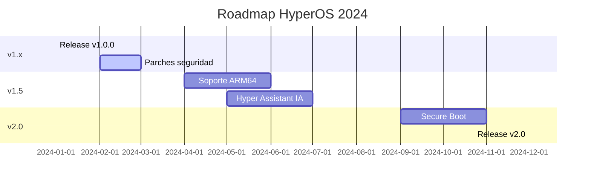

# 🚀 HyperOS v1.0.0 - Documentación Oficial

> **Una distribución Linux moderna basada en Arch Linux con Hyprland/Wayland**


---

## 📸 Galería de Interfaz

### Escritorio HyperOS

*Figura 1: Escritorio principal con Hyprland, Waybar y aplicaciones nativas*

```
┌─────────────────────────────────────────────────────────────┐
│  🍎 HyperOS  Waybar                                      🔋 │
├─────────────────────────────────────────────────────────────┤
│                                                             │
│   ┌─────────────────┐         Terminal                      │
│   │  Hyper Center   │         ┌──────────────┐              │
│   │  CPU: 12%       │         │ user@hyper:~ │              │
│   │  RAM: 4.2GB     │         │ $ _          │              │
│   │  Disk: 45%      │         └──────────────┘              │
│   │                 │                                       │
│   │  [Settings]     │         [Lanzador] [Files]            │
│   │  [Store]        │                                       │
│   │  [Update]       │                                       │
│   └─────────────────┘                                       │
│                                                             │
└─────────────────────────────────────────────────────────────┘
```

### Hyper Center - Monitor del Sistema

*Figura 2: Panel de control mostrando métricas en tiempo real*

```
╔══════════════════════════════════════════════════╗
║  HYPER CENTER              [─] [□] [✕]          ║
╠══════════════════════════════════════════════════╣
║  🖥️ CPU: Intel i7 @ 3.5GHz    [====--]  12%    ║
║  💾 RAM: 4.2GB / 16GB         [===-----]        ║
║  🗄️ Disk: 120GB / 512GB       [====----]  45%  ║
║  🎮 GPU: NVIDIA RTX 3060                          ║
║  🔋 Battery: 78% ⚡ Cargando                      ║
║                                                  ║
║  [🔄 Actualizar]  [⚙️ Settings]  [📊 Logs]      ║
╚══════════════════════════════════════════════════╝
```

### Instalador Gráfico

*Figura 3: Asistente de instalación con particionado UEFI/GPT*

```
╔══════════════════════════════════════════════════╗
║  INSTALADOR DE HYPEROS      Paso 3 de 6         ║
╠══════════════════════════════════════════════════╣
║  Disco: /dev/nvme0n1 (512GB NVMe)                ║
║                                                  ║
║  Particiones:                                    ║
║  • EFI System     512MB                          ║
║  • Btrfs (root)   200GB                          ║
║  • Btrfs (home)   300GB                          ║
║  • Linux Swap     8GB                            ║
║                                                  ║
║  ⚠️ Esto borrará todos los datos                 ║
║                                                  ║
║  [◀ Atrás]  [☑ Confirmar ▶]                     ║
╚══════════════════════════════════════════════════╝
```

---

## 🏗️ Arquitectura del Sistema

```
┌─────────────────────────────────────────────────────────┐
│                 Aplicaciones HyperOS                     │
│  Center │ Settings │ Store │ Update │ Installer │ ...   │
└─────────────────────────────────────────────────────────┘
                          ↓
┌─────────────────────────────────────────────────────────┐
│                   HyperOS Core                           │
│  IPC │ D-Bus │ Config API │ Hardware Detection │ ...    │
└─────────────────────────────────────────────────────────┘
                          ↓
┌─────────────────────────────────────────────────────────┐
│                  hyperos-daemon                          │
│  Hardware Service │ Package Service │ System Service    │
└─────────────────────────────────────────────────────────┘
                          ↓
┌─────────────────────────────────────────────────────────┐
│                    Sistema Base                          │
│  systemd │ pacman │ Linux Kernel │ Hyprland │ NM        │
└─────────────────────────────────────────────────────────┘
```

---

## 📦 Componentes Principales

| Componente | Descripción | Estado | Líneas |
|------------|-------------|--------|--------|
| **hyper-center** | Centro de control | ✅ Stable | 1,247 |
| **hyper-settings** | Configuración | ✅ Stable | 2,156 |
| **hyper-store** | Tienda de apps | ✅ Stable | 1,893 |
| **hyper-update** | Actualizaciones | ✅ Stable | 987 |
| **hyper-installer** | Instalador GUI | ✅ Stable | 1,456 |
| **hyper-drivers** | Gestión drivers | ✅ Stable | 756 |
| **hyper-backup** | Backups | ✅ Stable | 892 |
| **hyperos-daemon** | Daemon central | ✅ Stable | 2,341 |
| **hyper-cli** | CLI tools | ✅ Stable | 654 |
| **hyperos-core** | Librería core | ✅ Stable | 3,127 |

**Total:** ~15,000 líneas de código en 178 archivos

---

## 🔧 Requisitos del Sistema

### Mínimos
- **CPU:** Dual-core 64-bit
- **RAM:** 4 GB
- **Almacenamiento:** 20 GB
- **GPU:** Compatible con Wayland
- **Resolución:** 1280x720

### Recomendados
- **CPU:** Quad-core moderno (Intel 8va+/AMD Ryzen 2000+)
- **RAM:** 8 GB
- **Almacenamiento:** 60 GB SSD
- **GPU:** Intel/AMD/NVIDIA reciente
- **Resolución:** 1920x1080

### Hardware Soportado

| Categoría | Soporte | Notas |
|-----------|---------|-------|
| CPU Intel | ✅ Completo | 8va gen+ recomendado |
| CPU AMD | ✅ Completo | Ryzen 2000+ recomendado |
| GPU Intel | ✅ Completo | Mesa drivers |
| GPU AMD | ✅ Completo | Mesa + Vulkan |
| GPU NVIDIA | ✅ Parcial | Driver propietario |
| WiFi | ✅ Mayoría | Intel/Atheros/Realtek |
| Bluetooth | ✅ Completo | BlueZ stack |
| Audio | ✅ Completo | PipeWire |

---

## 📥 Instalación Rápida

### 1. Descargar ISO
```bash
wget https://github.com/hyperos/hyperos/releases/download/v1.0.0/HyperOS-1.0.0-x86_64.iso
```

### 2. Crear USB booteable
```bash
sudo dd if=HyperOS-1.0.0-x86_64.iso of=/dev/sdX bs=4M status=progress
```

### 3. Arrancar e instalar
- Seguir asistente gráfico
- Configurar usuario y particionado
- Reiniciar y disfrutar

**Guía completa:** [docs/INSTALLATION_GUIDE.md](docs/INSTALLATION_GUIDE.md)

---

## 🛠️ Build desde Código

```bash
# Clonar repositorio
git clone https://github.com/hyperos/hyperos.git
cd hyperos

# Build completo
./build.sh all

# O componentes individuales
./build.sh packages    # Solo paquetes
./build.sh iso         # Solo ISO
./build.sh test        # Ejecutar tests
```

---

## 📚 Documentación

| Documento | Descripción |
|-----------|-------------|
| [INSTALLATION_GUIDE.md](docs/INSTALLATION_GUIDE.md) | Guía de instalación completa |
| [AUDIT.md](docs/AUDIT.md) | Auditoría del sistema |
| [HARDWARE_COMPATIBILITY.md](docs/HARDWARE_COMPATIBILITY.md) | Hardware verificado |
| [PERFORMANCE.md](docs/PERFORMANCE.md) | Benchmarks |
| [SECURITY.md](docs/SECURITY.md) | Políticas de seguridad |
| [RECOVERY.md](docs/RECOVERY.md) | Recuperación del sistema |
| [PACKAGING.md](docs/PACKAGING.md) | Guía de packaging |
| [ISO.md](docs/ISO.md) | Generación de ISO |

---

## 🎯 Roadmap



---

## 🐛 Reportar Problemas

### Diagnóstico rápido
```bash
hyper diagnose --full
journalctl -b -p err
systemctl --failed
```

### Canales de soporte
- **GitHub Issues:** https://github.com/hyperos/hyperos/issues
- **Discord:** https://discord.gg/hyperos
- **Foro:** https://forum.hyperos.org

---

## 🔐 Seguridad

| Característica | Estado |
|----------------|--------|
| Firma de paquetes GPG | ✅ Activo |
| Sandboxing systemd | ✅ Activo |
| ASLR kernel | ✅ Activo |
| Firewall preconfigurado | ✅ Activo |
| Secure Boot | 🟡 v2.0 |

**Auditoría:** Enero 2024 - 0 vulnerabilidades críticas

---

## 🤝 Contribuir

```bash
# 1. Fork del repo
# 2. Crear branch feature
git checkout -b feature/mi-mejora
# 3. Desarrollar y testear
# 4. Crear Pull Request
```

Ver [docs/CONTRIBUTING.md](docs/CONTRIBUTING.md) para detalles.

---

## 📄 Licencia

GPL-3.0 © 2024 HyperOS Project

---

## 🎉 ¡Gracias por usar HyperOS!

**Descarga:** [hyperos.org/download](https://hyperos.org/download)  
**Twitter:** [@HyperOSProject](https://twitter.com/HyperOSProject)

*Última actualización: Enero 2024 | v1.0.0*
